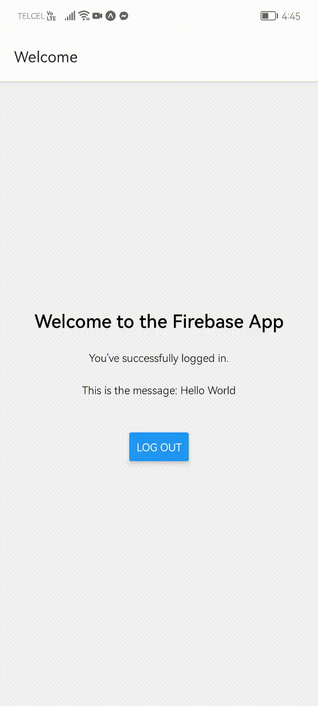
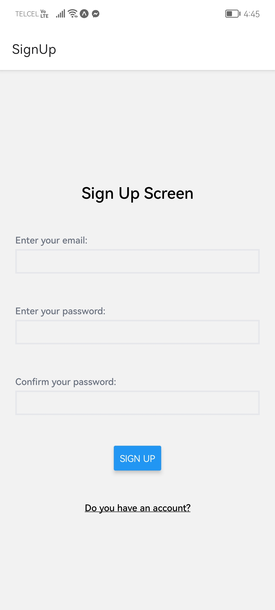
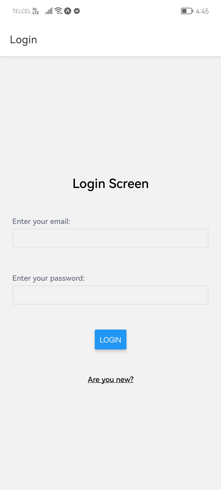
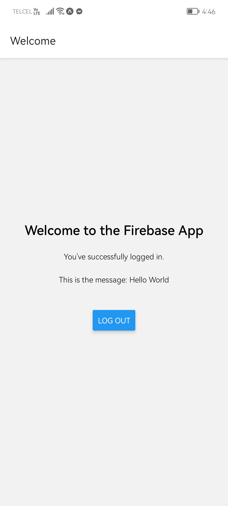

# The Login-Sign Up App.

This is the Login-Sign Up mobile where users can register their accounts and see content that is not visible for no
authenticated users. Besides, it saves the user toke in order to automatically logged user in.

A Firebase free database was created in order to denied access when the user is authenticated with token.
The token is sent inside of the URL.

## Demo.

This is the demo.

## Core Packages.

* Axios package.
* Async Storage package.
* Navigate package.
* Jotai package.
## Screenshots.

  
  
  

## Author.

- Jorge Ortiz.
- Software engineer.
- San Luis Potosí, S.L.P. México.
